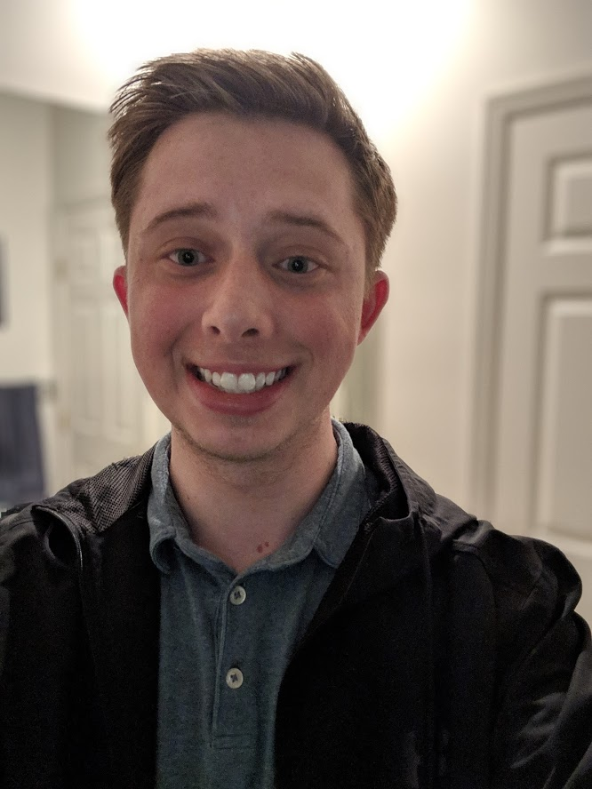

	 test
	 
Hi, I’m Cody! I am an electrical engineer from Dayton, Ohio, which has been my home for the past 6 years. I am currently employed as an electrical engineering defense contractor with Dynetics Inc., which is where I research, model, and simulate radar systems. My interest in signals developed during my internship at the Air Force Institute Technology (AFIT), where I was directly involved in wireless communication research.

Once my daily work is complete, you will most likely find me at a local coffee shop where all the baristas know me by name. I try to keep a healthy balance of work, socializing, and staying active (usually not a uniform distribution, but I try lol). 

---
<blockquote>
There's something profoundly optimistic about teaching. We are taking the best of what humans have to give - lifetimes of knowledge, wisdom, craft, and art - and handing it over to the next generation, with the hope that they will continue to build, continue to make our world better. It's a conversation with our past and future selves at once, a way of saying, look what we've done! Now what will you do with it?
<cite>Dr. Jill Biden</cite>
</blockquote>
